# MovieTicket
电影购票管理系统 亮点：协同过滤算法影片推荐、ECharts 影院经营数据看板、影片排片与可视化选座、座位锁定及超时自动释放、支付宝沙箱支付、订单退票申请审核、影片与影院收藏、影片评论点赞及回复； 

所有源码均本人开发，项目是前后端分离的，所有的项目都具备了完整的业务逻辑，不仅仅局限于基础的增删改查（CRUD）操作，系统亮点众多。

本文注重于计算机毕业设计选题指导，列出题目均有源码， 大家可以去【公众号】(毕业终点站)获取或者加我【qq】(2112698948)提意见(别忘记Star哟)。备注：git

声明：仅用于学习使用，请勿用于任何商业行为！

1.系统非商用，非开源，非无偿。

2.由本人开发，如需源码，请联系以下方式，qq:2112698948。

3.项目有很多，并未全部上传，如果未找到想要的，可直接咨询。

# 电影购票管理系统

> Vue 3 + Spring Boot 3 前后端分离的电影在线购票平台，覆盖影片检索、影院排片、可视化选座、在线支付到退票审核与经营分析的完整链路。

**系统亮点**：协同过滤算法影片推荐 · ECharts 影院经营数据看板 · 影片排片与可视化选座 · 座位锁定及超时自动释放 · 支付宝沙箱支付 · 订单退票申请审核 · 影片与影院收藏 · 影片评论点赞及回复

## 一、项目概述

电影购票系统采用前后端分离架构，面向普通用户和管理员构建“影片发布—影院排片—影片检索—在线选座—订单创建—支付确认—观影完成—退票审核—运营分析”的服务流程。普通用户可浏览热映、最新上映和全部影片，按影片名称、导演、演员及影片类型进行筛选，查看影片详情、演职人员、评分、评论和可购场次；用户可选择影院、影厅和排片后进行可视化选座，系统在创建订单时锁定座位，并在超时未支付时自动取消订单、释放座位。完成支付后，用户可在个人中心查看订单、申请退票、维护个人资料和密码，以及收藏感兴趣的影片和影院、发布影片评论并进行点赞互动。管理员负责用户账号、影院、影厅类型、影厅、座位、影片类型、影片、电影相关人员、影片排片、排片座位、订单及订单座位的统一维护，同时可处理退票申请，管理用户收藏、影片评论、评论点赞和评论回复，并通过经营数据看板查看平台运营情况。

## 二、技术架构

| 层级 | 主要技术与职责 |
| :--- | :--- |
| 用户服务端 | 基于 Vue 3、Vite、Element Plus、Pinia、Vue Router 和 Axios 构建，提供影片浏览与筛选、影院查询、影片详情、协同过滤推荐、在线选座、订单确认、支付宝沙箱支付、订单与退票申请、影片及影院收藏、评论点赞和个人资料维护等功能。 |
| 管理工作台 | 基于 Vue 3、Element Plus 和 ECharts 实现。管理员可维护用户、影院、影厅、座位、影片分类、影片、演职人员、排片、订单及互动数据，审核退票申请，并通过总票房、今日票房、订单量、近 7 天票房趋势、热门影片、支付方式分布、订单状态分布和影院上座率等数据掌握经营情况。 |
| 服务端 | 基于 Spring Boot 3、Java 17、Spring MVC、MyBatis-Plus、MySQL 和 JWT 提供 REST 接口、分页查询、文件上传、当前用户身份解析、统一响应与异常处理及数据持久化能力；接入支付宝沙箱 SDK，并以定时任务处理订单超时、座位释放、支付状态查询和已支付订单自动完成。 |
| 推荐与座位能力 | 推荐模块根据用户订单、影片评分和收藏行为构建用户—影片评分矩阵，采用余弦相似度筛选相似用户，为用户推荐其未接触的影片；当用户缺少行为数据或相似用户不足时，按影片评分返回热门影片。选座模块以排片座位为维度维护可售、锁定和已售状态，创建订单后限时锁座，支付成功后确认售出，退票审核通过或订单超时后释放座位并更新剩余座位数。 |

## 三、核心业务流程

1. **影片检索**：按影片名称、导演、演员、类型筛选影片，查看详情、评分与评论。
2. **在线选座**：选择影院、影厅与排片后可视化选座，座位状态实时同步。
3. **锁座支付**：创建订单即锁定座位，超时未支付自动取消订单并释放座位。
4. **支付完成**：支付宝沙箱支付成功后确认售出，写入订单座位明细。
5. **退票处理**：用户发起退票申请，管理员审核通过后释放座位并更新余座。
6. **运营分析**：管理端数据看板汇总票房、订单与影院上座率，辅助经营决策。

## 四、个性化影片推荐

推荐模块以用户订单、影片评分和收藏行为作为数据源，构建**用户—影片评分矩阵**，通过余弦相似度计算用户之间的相似度，筛选与目标用户兴趣最接近的若干相似用户，再把相似用户看过而目标用户尚未接触的影片作为推荐结果返回。对于新用户或行为数据不足、相似用户数量不够的情况，系统降级为按影片评分排序的**热门影片推荐**，保证冷启动阶段同样有内容可展示。

## 五、界面展示

以下截图均存放于仓库 `images/` 目录，不依赖外部图床。

### 5.1 系统总览

**图 01 · 系统总览**：系统整体功能与模块全景。

### 5.2 影迷端

面向普通观影用户，覆盖「浏览影片 → 选择影院场次 → 可视化选座 → 下单支付 → 订单与退票 → 收藏互动」的完整购票流程。

**图 02 · 首页**：首页聚合热映、最新上映与全部影片入口，并按偏好给出推荐影片。

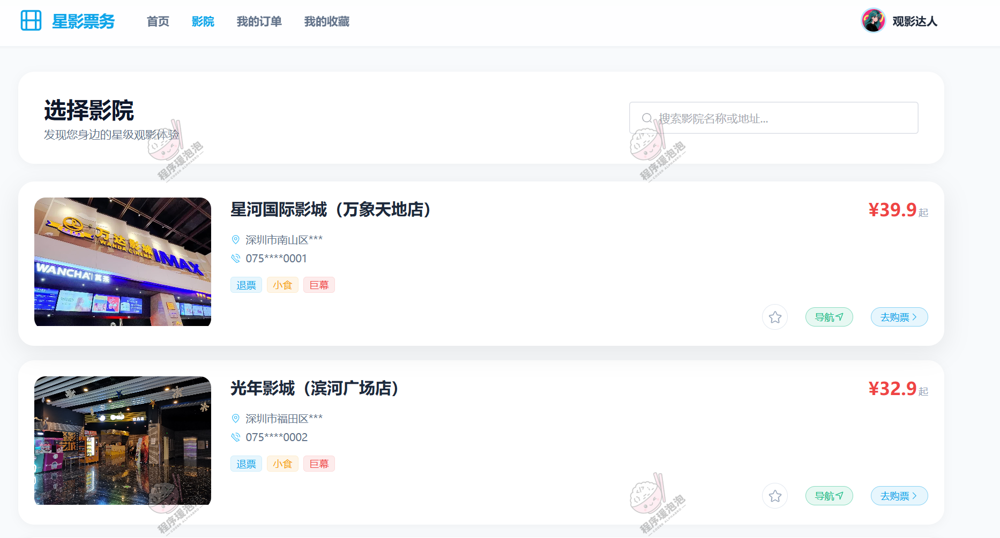

**图 03 · 影院**：影院列表支持按地区与条件筛选，快速定位想去的影院。

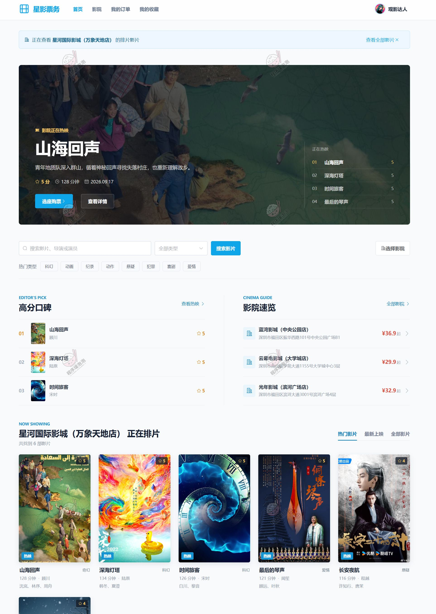

**图 04 · 影院详情**：影院详情页展示影院信息、影厅构成与当日可购场次。

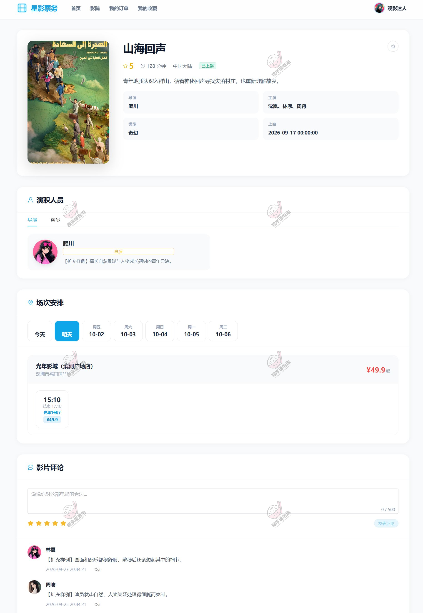

**图 05 · 影片详情**：影片详情包含剧情简介、演职人员、评分、评论与可购场次。

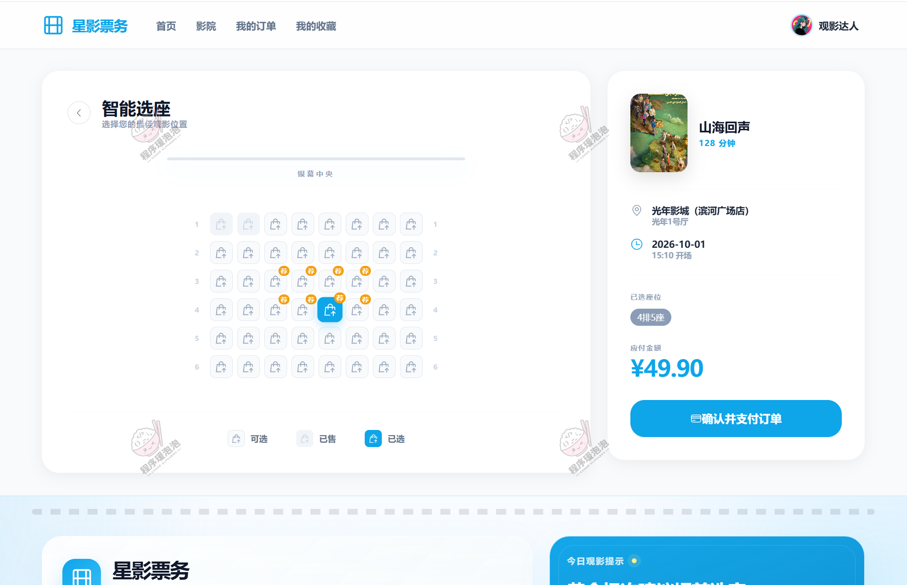

**图 06 · 选座**：在线可视化选座，座位实时区分可售、锁定与已售三种状态。

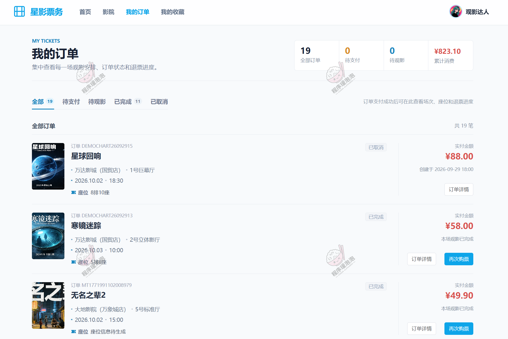

**图 07 · 我的订单**：我的订单跟踪购票状态，支持发起退票申请。

**图 08 · 我的收藏**：收藏夹统一管理感兴趣的影片与影院。

### 5.3 管理员端

面向影院运营方，负责影片、影院、影厅、座位、排片、订单等基础数据的统一维护，处理退票申请与评论互动，并通过数据看板掌握经营情况。

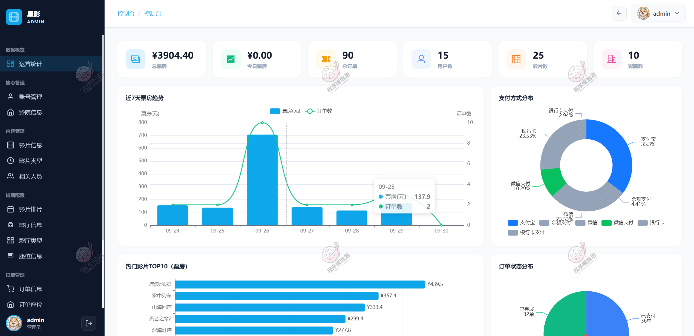

**图 09 · 数据分析**：管理端经营看板，汇总票房、订单量、趋势与上座率等指标。

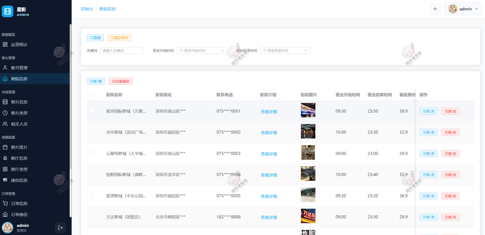

**图 10 · 影院信息**：影院基础信息与联系方式维护。

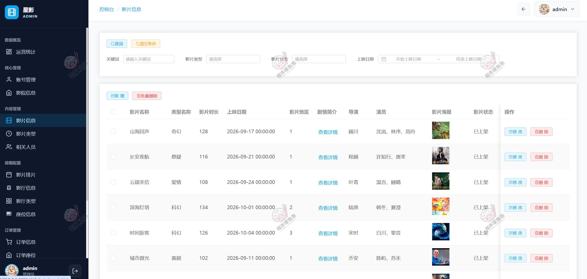

**图 11 · 影片信息**：影片档案维护，含分类、上架状态与详情内容。

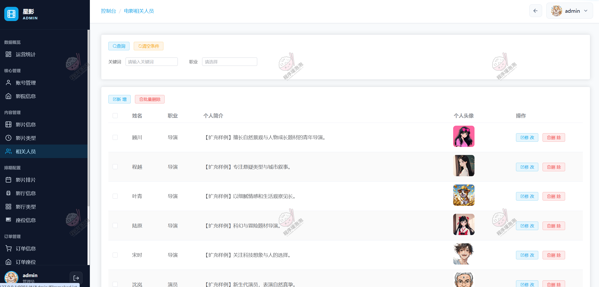

**图 12 · 相关人员**：导演、演员等演职人员信息维护。

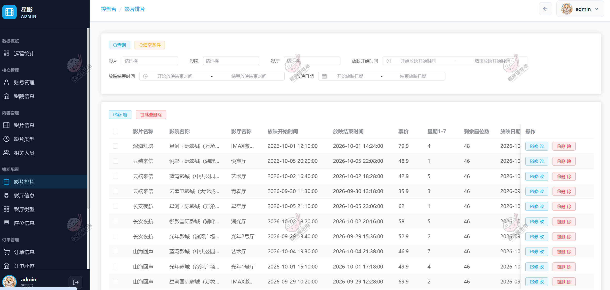

**图 13 · 影片排片**：排片管理，安排影片、影厅、场次与票价。

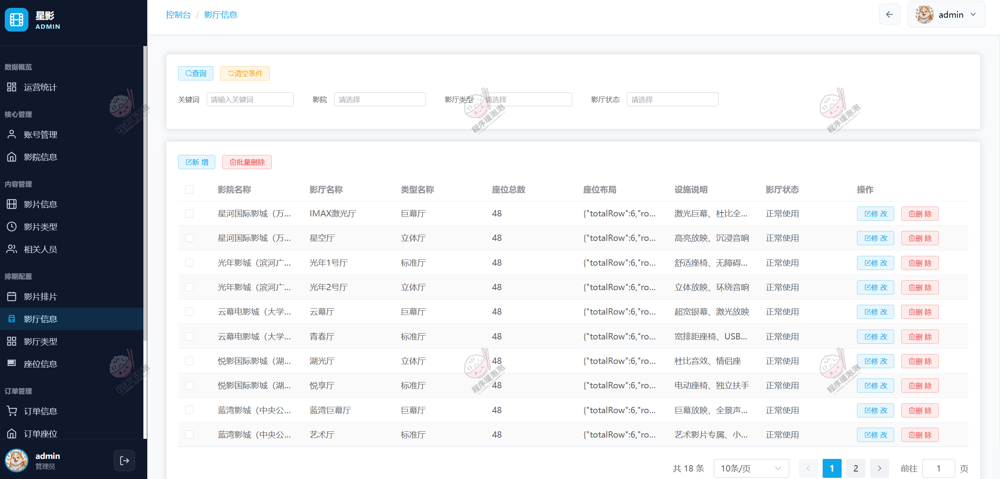

**图 14 · 影厅信息**：影厅与影厅类型配置。

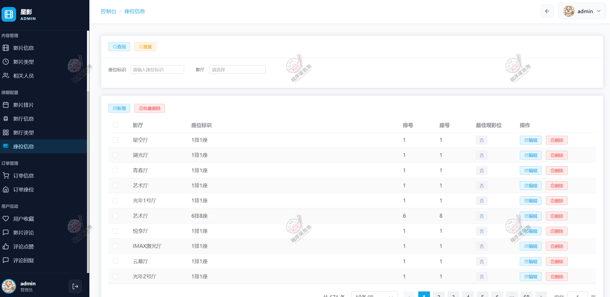

**图 15 · 座位信息**：影厅座位布局维护，生成可售座位数据。

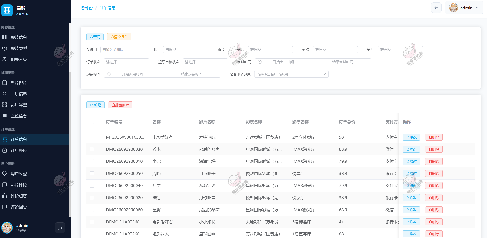

**图 16 · 订单信息**：订单查询与退票申请审核处理。

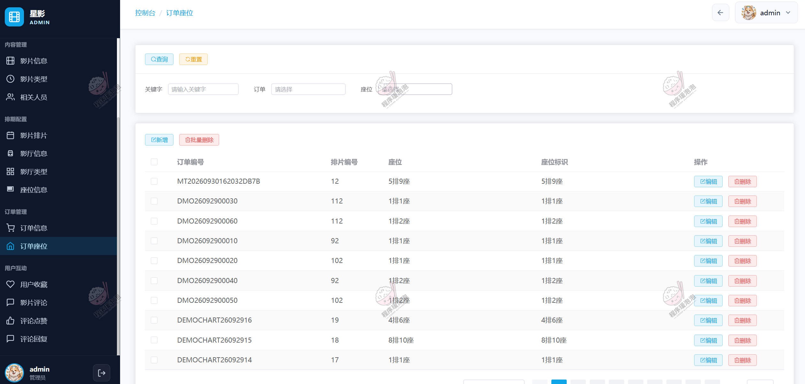

**图 17 · 订单座位**：订单对应座位明细，核对售票情况。

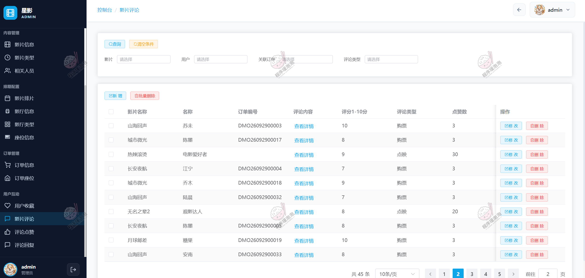

**图 18 · 影片评论**：影片评论及点赞、回复的管理。

## 六、说明

- 本文所展示的系统界面与数据均为演示环境下的测试内容，仅用于说明系统功能与设计思路。
- **本项目仅用于学习交流，非商用、非开源、非无偿。**
- 文档展示 18 张截图，需要了解更多，请联系我。

